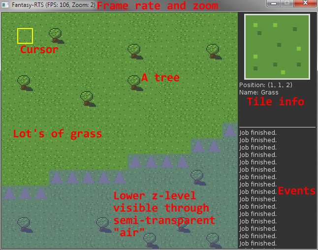
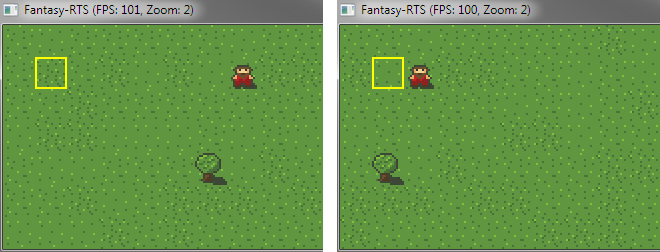
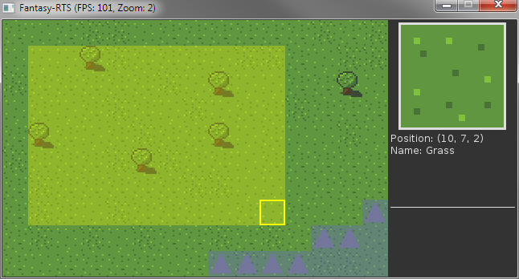
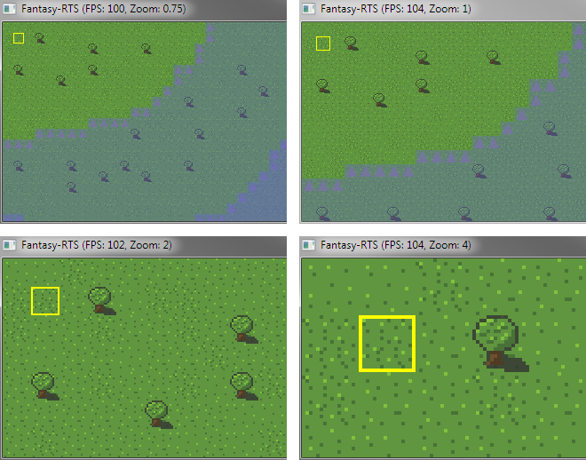
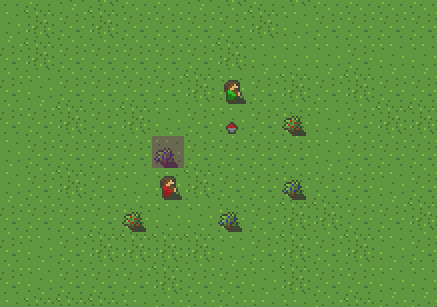
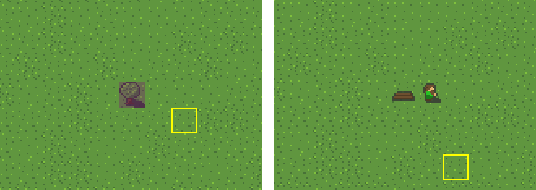
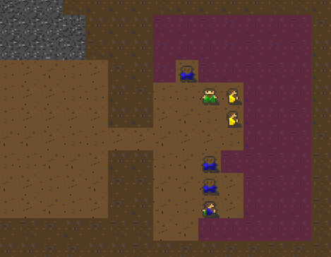

# Tutorial: Overview

## User Interface

## Camera Movement

To move the camera on the current z-level press the `w`, `a`, `s` or `d` keys. Press `q` or `e` for switching the z-level.

## Cursor

The cursor can be controlled by the mouse or using the arrow keys.

## Mouse Selection

By pressing any mouse button you can create a selection. Currently this is only used to mark certain areas for jobs like chopping trees.

## Mouse Zoom

By using the mouse wheel you can zoom in and out. For the current zoom level see the title bar.

## Jobs

To start an job press the associated keys and then select a position or an area if necessary. Jobs are automatically executed by your units. They are highlighted by a purple overlay.

### Canceling Jobs

To cancel jobs press the key `x` and select the highlightings of the jobs you want to cancel.

### Forestry

In forestry mode which is activated by first pressing `f` jobs can be executed which are related to forest and plant work. If you want to leave the forestry mode press `backspace`. 

#### Harvesting food

To harvest food press `h` while in forestry mode. Afterwards to can harvest different plants like berry shrubs.

#### Wood chopping

Wood chopping is activated by pressing the key `c` while in forestry mode. Trees will drop wood logs after chopping them.

### Mining

In mining mode which is activated by first pressing `m` jobs can be executed which are related to mining and digging. If you want to leave the mining mode press `backspace`. 

#### Digging

Digging enables to dig on the current z-level. By digging earth and rock is destroyed and resources like iron ore became available. Digging is started using the key `m` while in harvesting mode.

## Save / Load

Currently not supported. A new game is created every time the application is started.